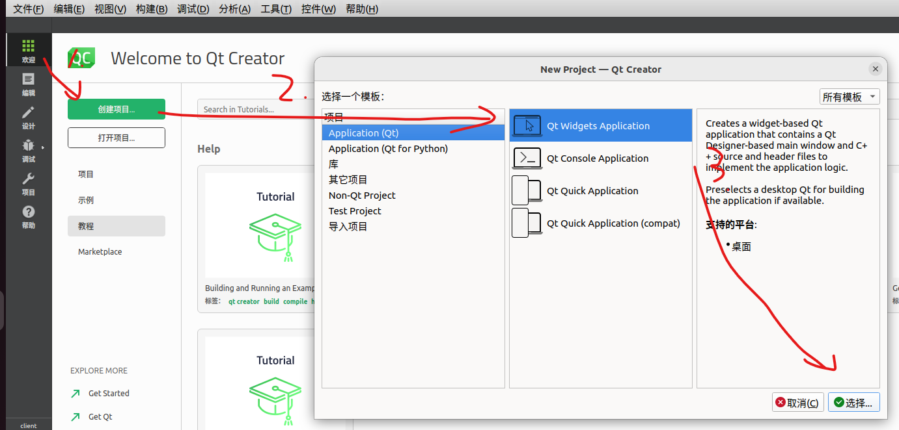

## Qt入门
### 1 Qt概述
#### 1.1 Qt特点
Qt特点：
- 跨平台
- 独立事件处理机制
- 高效的窗口开发应用(GUI)
- c++扩展
- 面向对象

#### 1.2 Qt模块
Qt类库里大量的类根据功能分为各种模块，这些模块又分为以下几大类：
- Qt 基本模块(Qt Essentials)：提供了 Qt 在所有平台上的基本功能。
- Qt 附加模块(Qt Add-Ons)：实现一些特定功能的提供附加价值的模块。
- 增值模块(Value-AddModules)：单独发布的提供额外价值的模块或工具。
- 技术预览模块(Technology Preview Modules)：一些处于开发阶段，但是可以作为技术预览使用的模块。
- Qt 工具(Qt Tools)：帮助应用程序开发的一些工具。

| 模块 | 描述 |
| --- | --- |
| Qt Core | Qt 类库的核心，所有其他模块都依赖于此模块 |
| Qt GUI | 设计 GUI 界面的基础类，包括 OpenGL |
| Qt Widgets | 用于构建 GUI 界面的 C++ 图形组件类 |

#### 1.3 Qt案例
VirtualBox：虚拟机软件。
VLC多媒体播放器：一个体积小巧、功能强大的开源媒体播放器。
YY语音：又名“歪歪语音”，是一个可以进行在线多人语音聊天和语音会议的免费软件。
咪咕音乐：咪咕音乐是中国移动倾力打造的正版音乐播放器
WPS Office：金山公司（Kingsoft）出品的办公软件，与微软Office兼容性良好，个人版免费。
Skype：一个使用人数众多的基于P2P的VOIP聊天软件。

### 2 Qt安装
#### 安装包下载
开源下载：https://www.qt.io/download-qt-installer-oss?hsCtaTracking=99d9dd4f-5681-48d2-b096-470725510d34%7C074ddad0-fdef-4e53-8aa8-5e8a876d6ab4

### 3 Qt项目
#### 3.1 创建项目



遇到问题：select kits无法选择
原因：未正确安装Qtcreator 
解决方法：重装了Qt,以默认的Qt desktop development安装

#### 3.2 项目文件.pro
该文件中记录着项目的一些属性信息以及引入的模块

#### 3.3 main.cpp
程序入口文件，包含main函数
```cpp
#include "mainwindow.h"		// 生成的窗口类头文件
#include <QApplication>		// 应用程序类头文件

int main(int argc, char *argv[])
{
    // 创建应用程序对象, (单例对象)
    // 类的作用: 检测触发的事件, 进行事件循环并处理
    QApplication a(argc, argv);
    // 创建窗口类对象
    MainWindow w;
    // 显示窗口
    w.show();
    // 应用程序对象开始事件循环, 保证应用程序不退出
    return a.exec();
}
```

#### 3.4 mainwindow.ui
用记事本打开是xml类型文件，在Qt是UI界面开发的窗口
在创建项目选择的窗口类中的Ui命名空间下有一个同名的指针 
> Ui::MainWindow *ui;

#### 3.5 mainwindow
.h头文件为窗口界面对于的头文件
.cpp为实现文件 在构造函数中完成了对ui界面的初始化
```cpp
MainWindow::MainWindow(QWidget *parent)
    : QMainWindow(parent)
    , ui(new Ui::MainWindow)	// 基于mainwindow.ui创建一个实例对象
{
    // 将 mainwindow.ui 的实例对象和 当前类的对象进行关联
    // 这样同名的连个类对象就产生了关联, 合二为一了
    ui->setupUi(this);
}
MainWindow::~MainWindow()
{
    delete ui;
}
```

### 4 Qt窗口类
#### 4.1 关系
Qdialog 和 QMainWindow 继承自QWidget


#### 4.2 区别
QWidget 所有窗口类的基类 可内嵌也可不内嵌
QDialog 对话框类，无法内嵌 模态对话框阻塞与其他窗口的交互 非模态对话框不阻塞
QMainWindow 主窗口类，无法内嵌 附带工具栏、状态栏和菜单栏

### 5. Qt坐标体系
Qt的坐标原点在**父窗口**的左上角，x轴向右递增，y轴向下递增

指定坐标方式：
```cpp
QPushButton *btn A =new QPushButton(this);
btnA->move(100,100);
```

### 6. Qt内存回收机制
在Qt中创建对象的时候会提供一个 Parent对象指针

QObject是以对象树的形式组织起来的。当创建一个QObject对象时，会看接收一个QObject指针作为参数，这个参数就是 parent父对象指针。当我们创建的这个QObject对象会自动添加到其父对象的children()列表。当父对象析构的时候，这个列表中的所有对象也会被析构。（

QWidget是能够在屏幕上显示的一切组件的父类。其继承自QObject，因此也继承了这种对象树关系。一个孩子自动地成为父组件的一个子组件。因此，它会显示在父组件的坐标系统中，被父组件的边界剪裁。例如，当用户关闭一个对话框的时候，应用程序将其删除，那么，我们希望属于这个对话框的按钮、图标等应该一起被删除。事实就是如此，因为这些都是对话框的子组件。

当一个QObject对象在堆上创建的时候，Qt 会同时为其创建一个对象树。不过，对象树中对象的顺序是没有定义的。这意味着，销毁这些对象的顺序也是未定义的。

任何对象树中的 QObject对象 delete 的时候，如果这个对象有 parent，则自动将其从 parent 的children()列表中删除；如果有孩子，则自动 delete 每一个孩子。Qt 保证没有QObject会被 delete 两次，这是由析构顺序决定的。

## Qt基础
### 1. Qt基本数据类型
QT基本数据类型定义在<QtGlobal>中，基本类型如下：


### 2. Qt日志输出
Qt框架提供了用于日志输出的类, 头文件名为<QDebug>

```cpp
#include <QDebug>
// 使用方法
// 输出到输出终端
qDebug()<<"Debug";
// qWarning(), qInfo(), qCritical()
```

在打开ui界面时打开终端窗口的方法：
在.pro文件的CONFIG字段后加 console(windows)

### 3. Qt字符串类型
在Qt中不仅支持C, C++中的字符串类型, 而且还在框架中定义了专属的字符串类型, 我们必须要掌握在Qt中关于这些类型的使用和相互之间的转换。

| 语言类型 | 字符串类型 |
| --- | --- |
| C | char* |
| C++ | std::string, char* |
| Qt | QByteArray, QString 等 |

#### 3.1 QByteArray
构造函数
```cpp
QByteArray::QByteArray();
// 如果 size==-1 函数内部自动计算字符串长度, 计算方式为: strlen(data)
QByteArray::QByteArray(const char *data, int size = -1);
// 构造一个长度为size个字节, 并且每个字节值都为ch的字节数组
QByteArray::QByteArray(int size, char ch);
```

数据操作
```cpp
// 在尾部追加数据
QByteArray &QByteArray::append(const QByteArray &ba);
void QByteArray::push_back(const QByteArray &other);

// 头部添加数据
QByteArray &QByteArray::prepend(const QByteArray &ba);
void QByteArray::push_front(const QByteArray &other);

// 插入数据, 将ba插入到数组第 i 个字节的位置(从0开始)
QByteArray &QByteArray::insert(int i, const QByteArray &ba);

// 删除数据 从大字符串中删除len个字符, 从第pos个字符的位置开始删除
QByteArray &QByteArray::remove(int pos, int len);

// 从字符数组的尾部删除 n 个字节
void QByteArray::chop(int n);

// 从字节数组的 pos 位置将数组截断 (前边部分留下, 后边部分被删除)
void QByteArray::truncate(int pos);

// 将对象中的数据清空, 使其为null
void QByteArray::clear();

// 字符串替换
// 将字节数组中的 子字符串 before 替换为 after
QByteArray &QByteArray::replace(const QByteArray &before, const QByteArray &after);
```

字串查找和判断
```cpp
// 判断字节数组中是否包含子字符串 ba, 包含返回true, 否则返回false
bool QByteArray::contains(const QByteArray &ba) const;
bool QByteArray::contains(const char *ba) const;
// 判断字节数组中是否包含子字符 ch, 包含返回true, 否则返回false
bool QByteArray::contains(char ch) const;

// 判断字节数组是否以字符串 ba 开始, 是返回true, 不是返回false
bool QByteArray::startsWith(const QByteArray &ba) const;
bool QByteArray::startsWith(const char *ba) const;
// 判断字节数组是否以字符 ch 开始, 是返回true, 不是返回false
bool QByteArray::startsWith(char ch) const;

// 判断字节数组是否以字符串 ba 结尾, 是返回true, 不是返回false
bool QByteArray::endsWith(const QByteArray &ba) const;
bool QByteArray::endsWith(const char *ba) const;
// 判断字节数组是否以字符 ch 结尾, 是返回true, 不是返回false
bool QByteArray::endsWith(char ch) const;
```

遍历
```cpp
// 使用迭代器
iterator QByteArray::begin();
iterator QByteArray::end();

// 使用数组的方式进行遍历
// i的取值范围 0 <= i < size()
char QByteArray::at(int i) const;
char QByteArray::operator[](int i) const;
```

查看字节数
```cpp
// 返回字节数组对象中字符的个数
int QByteArray::length() const;
int QByteArray::size() const;
int QByteArray::count() const;

// 返回字节数组对象中 子字符串ba 出现的次数
int QByteArray::count(const QByteArray &ba) const;
int QByteArray::count(const char *ba) const;
// 返回字节数组对象中 字符串ch 出现的次数
int QByteArray::count(char ch) const;
```

类型转换
```cpp
// 将QByteArray类型的字符串 转换为 char* 类型
char *QByteArray::data();
const char *QByteArray::data() const;

// int, short, long, float, double -> QByteArray
// 其他重载的同名函数可参考Qt帮助文档, 此处略
QByteArray &QByteArray::setNum(int n, int base = 10);
QByteArray &QByteArray::setNum(short n, int base = 10);
QByteArray &QByteArray::setNum(qlonglong n, int base = 10);
QByteArray &QByteArray::setNum(float n, char f = 'g', int prec = 6);
QByteArray &QByteArray::setNum(double n, char f = 'g', int prec = 6);
[static] QByteArray QByteArray::number(int n, int base = 10);
[static] QByteArray QByteArray::number(qlonglong n, int base = 10);
[static] QByteArray QByteArray::number(double n, char f = 'g', int prec = 6);

// QByteArray -> int, short, long, float, double
int QByteArray::toInt(bool *ok = Q_NULLPTR, int base = 10) const;
short QByteArray::toShort(bool *ok = Q_NULLPTR, int base = 10) const;
long QByteArray::toLong(bool *ok = Q_NULLPTR, int base = 10) const;
float QByteArray::toFloat(bool *ok = Q_NULLPTR) const;
double QByteArray::toDouble(bool *ok = Q_NULLPTR) const;

// std::string -> QByteArray
[static] QByteArray QByteArray::fromStdString(const std::string &str);
// QByteArray -> std::string
std::string QByteArray::toStdString() const;

// 转换大小写
QByteArray QByteArray::toUpper() const;
QByteArray QByteArray::toLower() const;
```

#### 3.2 QString
构造函数
```cpp
造一个空字符串对象
QString::QString();
// 将 char* 字符串 转换为 QString 类型
QString::QString(const char *str);
// 将 QByteArray 转换为 QString 类型
QString::QString(const QByteArray &ba);
```

数据操作
```cpp
// 尾部追加数据
QString &QString::append(const QString &str);
QString &QString::append(const char *str);
QString &QString::append(const QByteArray &ba);
void QString::push_back(const QString &other);

// 头部添加数据
QString &QString::prepend(const QString &str);
QString &QString::prepend(const char *str);
QString &QString::prepend(const QByteArray &ba);
void QString::push_front(const QString &other);

// 插入数据, 将 str 插入到字符串第 position 个字符的位置(从0开始)
QString &QString::insert(int position, const QString &str);
QString &QString::insert(int position, const char *str);
QString &QString::insert(int position, const QByteArray &str);

// 删除数据
// 从大字符串中删除len个字符, 从第pos个字符的位置开始删除
QString &QString::remove(int position, int n);

// 从字符串的尾部删除 n 个字符
void QString::chop(int n);
// 从字节串的 position 位置将字符串截断 (前边部分留下, 后边部分被删除)
void QString::truncate(int position);
// 将对象中的数据清空, 使其为null
void QString::clear();

// 字符串替换
// 将字节数组中的 子字符串 before 替换为 after
// 参数 cs 为是否区分大小写, 默认区分大小写
QString &QString::replace(const QString &before, const QString &after, Qt::CaseSensitivity cs = Qt::CaseSensitive);
```

子串查找和判断
```cpp
// 参数 cs 为是否区分大小写, 默认区分大小写
// 判断字符串中是否包含子字符串 str, 包含返回true, 否则返回false
bool QString::contains(const QString &str, Qt::CaseSensitivity cs = Qt::CaseSensitive) const;

// 判断字符串是否以字符串 ba 开始, 是返回true, 不是返回false
bool QString::startsWith(const QString &s, Qt::CaseSensitivity cs = Qt::CaseSensitive) const;

// 判断字符串是否以字符串 ba 结尾, 是返回true, 不是返回false
bool QString::endsWith(const QString &s, Qt::CaseSensitivity cs = Qt::CaseSensitive) const;
```

遍历
```cpp
iterator QString::begin();
iterator QString::end();

// 使用数组的方式进行遍历
// i的取值范围 0 <= position < size()
const QChar QString::at(int position) const
const QChar QString::operator[](int position) const;
```

查看字节数
```cpp
// 返回字节数组对象中字符的个数 (字符个数和字节个数是不同的概念)
int QString::length() const;
int QString::size() const;
int QString::count() const;

// 返回字节串对象中 子字符串 str 出现的次数
int QString::count(const QStringRef &str, Qt::CaseSensitivity cs = Qt::CaseSensitive) const;
```

类型转换
```cpp
// 将int, short, long, float, double 转换为 QString 类型
QString &QString::setNum(int n, int base = 10);
QString &QString::setNum(short n, int base = 10);
QString &QString::setNum(long n, int base = 10);
QString &QString::setNum(float n, char format = 'g', int precision = 6);
QString &QString::setNum(double n, char format = 'g', int precision = 6);
[static] QString QString::number(long n, int base = 10);
[static] QString QString::number(int n, int base = 10);
[static] QString QString::number(double n, char format = 'g', int precision = 6);

// 将 QString 转换为 int, short, long, float, double 类型
int QString::toInt(bool *ok = Q_NULLPTR, int base = 10) const;
short QString::toShort(bool *ok = Q_NULLPTR, int base = 10) const;
long QString::toLong(bool *ok = Q_NULLPTR, int base = 10) const
float QString::toFloat(bool *ok = Q_NULLPTR) const;
double QString::toDouble(bool *ok = Q_NULLPTR) const;

// 将标准C++中的 std::string 类型 转换为 QString 类型
[static] QString QString::fromStdString(const std::string &str);
// 将 QString 转换为 标准C++中的 std::string 类型
std::string QString::toStdString() const;

// QString -> QByteArray
// 转换为本地编码, 跟随操作系统
QByteArray QString::toLocal8Bit() const;
// 转换为 Latin-1 编码的字符串 不支持中文
QByteArray QString::toLatin1() const;
// 转换为 utf8 编码格式的字符串 (常用)
QByteArray QString::toUtf8() const;

QString QString::toUpper() const;
QString QString::toLower() const;
```

字符串格式化
```cpp
QString QString::arg(const QString &a, 
          int fieldWidth = 0, 
          QChar fillChar = QLatin1Char( ' ' )) const;
QString QString::arg(int a, int fieldWidth = 0, 
          int base = 10, 
          QChar fillChar = QLatin1Char( ' ' )) const;
```

### 4. Qt QVariant
QVariant 这个类型充当着最常见的数据类型的联合。QVariant 可以保存很多Qt的数据类型，包括QBrush、QColor、QCursor、QDateTime、QFont、QKeySequence、 QPalette、QPen、QPixmap、QPoint、QRect、QRegion、QSize和QString，并且还有C++基本类型，如 int、float等

可以存储多种类型的数据但是一次只能存储一种类型

构造方法
```cpp
// 直接构造支持的类型
QVariant::QVariant(int val);
QVariant::QVariant(bool val);
QVariant::QVariant(double val);
QVariant::QVariant(const char *val);
QVariant::QVariant(const QByteArray &val);
QVariant::QVariant(const QString &val);

// T 为类型
void QVariant::setValue(const T &value);
[static] QVariant QVariant::fromValue(const T &value);
```

### 5. 信号槽
#### 5.1 概述
信号类似于事件，信号槽类似于事件处理函数，事件触发机制是当事件发生时会发出信号，感兴趣的函数（槽）会连接信号并进行相应的处理，类似于观察者模式
而事件的产生和信号的发送都由Qt实现，只需要关心事件发生后需要做什么而设计

#### 5.2 信号本质
信号是由于用户对窗口或控件进行了某些操作，导致窗口或控件产生了某个特定事件，这时候Qt对应的窗口类会发出某个信号，以此对用户的挑选做出反应。

其本质是事件，如按钮单击、双击；窗口刷新；鼠标移动、鼠标按下、鼠标释放；键盘输入。

信号的呈现形式就是函数， 也就是说某个事件产生了， Qt框架就会调用某个对应的信号函数， 通知使用者。

#### 5.3 槽本质
槽即信号处理函数，负责对Qt框架中产生的信号进行处理

#### 5.4 信号和槽的关系
在Qt中我们需要使用QOjbect类中的connect函数对二者关联
```cpp
QMetaObject::Connection QObject::connect(
    	const QObject *sender, PointerToMemberFunction signal, 
        const QObject *receiver, PointerToMemberFunction method, 
		Qt::ConnectionType type = Qt::AutoConnection);
/*
  参数:
  - sender:   发出信号的对象
  - signal:   属于sender对象, 信号是一个函数, 这个参数的类型是函数
              指针, 信号函数地址
  - receiver: 信号接收者
  - method:   属于receiver对象, 当检测到sender发出了signal信号, 
              receiver对象调用method方法，信号发出之后的处理动作
 */

//  参数 signal 和 method 都是函数地址, 因此简化之后的 connect() 如下:
connect(const QObject *sender, &QObject::signal, 
        const QObject *receiver, &QObject::method);
// 本质是回调函数
```

#### 5.5 信号槽的使用
在ui中创建某组件，如btn，在窗口类如（mainwindow）中注册信号槽事件即可
```cpp
// ui->closewindow ：组件
// &QPushButton::clicked ：信号类型
// this ：信号接受窗口
// &MainWindow::close ：槽函数（回调函数）
connect(ui->closewindow, &QPushButton::clicked, this, &MainWindow::close);
```

自定义信号
```cpp
//0. 在类中必须声明宏Q_OBJECT
//1. 是类的成员函数
//2. 返回值 void 类型
//3. 信号名可变 支持重载
//4. 使用 signals 类似于public等关键字
//5. 信号函数只需要声明, 不定义

//习惯性在信号函数前加关键字: emit, 但是可以省略不写
//emit只是显示的声明一下信号要被发射了, 没有特殊含义
//底层 emit == #define emit
class Test : public QObject
{
    Q_OBJECT
signals:
    void testsignal();
	// 参数的作用是数据传递, 谁调用信号函数谁就指定实参
	// 实参最终会被传递给槽函数
    void testsignal(int a);
};
```

自定义槽函数
```cpp
//0. 返回值必须是 void 类型
//1. 槽函数支持重载
//2. 槽函数参数数量要少于等于信号函数参数个数且参数类型要一致，信号传递的数据就是槽函数的参数
//3. 槽函数可以是类的成员函数、全局函数、静态函数、Lambda表达式（匿名函数）
//4. 槽函数可以使用关键字进行声明: slots (Qt5中slots可以省略不写)   
    //public slots:
    //private slots: 

class Test : public QObject
{
    Q_OBJECT
public:
    void testSlot();
    static void testFunc();

public slots:
    void testSlot(int id);
};
```

### 6. Lambda函数
Lambda表达式：匿名函数
>\[capture](params) opt -> ret {body;};
>   - capture: 捕获列表
>   - params: 参数列表
>   - opt: 函数选项
>   - ret: 返回值类型
>   - body: 函数体

1. 捕获列表: 捕获一定范围内的变量
[] - 不捕捉任何变量
[&] - 捕获外部作用域中所有变量, 并作为引用在函数体内使用 (按引用捕获)
[=] - 捕获外部作用域中所有变量, 并作为副本在函数体内使用 (按值捕获)
&emsp;拷贝的副本在匿名函数体内部是只读的 
[=, &foo] - 按值捕获外部作用域中所有变量, 并按照引用捕获外部变量 foo
[bar] - 按值捕获 bar 变量, 同时不捕获其他变量
[&bar] - 按引用捕获 bar 变量, 同时不捕获其他变量
[this] - 捕获当前类中的this指针
&emsp;让lambda表达式拥有和当前类成员函数同样的访问权限
&emsp;如果已经使用了 & 或者 =, 默认添加此选项
2. 参数列表: 和普通函数的参数列表一样
3. opt 选项 –> 可以省略
&emsp;mutable: 可以修改按值传递进来的拷贝（注意是能修改拷贝，而不是值本身）
&emsp;exception: 指定函数抛出的异常，如抛出整数类型的异常，可以使用throw();
4. 返回值类型:
标识函数返回值的类型，当返回值为void，或者函数体中只有一处return的地方（此时编译器可以自动推断出返回值类型）时，这部分可以省略
5. 函数体:
函数的实现，这部分不能省略，但函数体可以为空。

### 7. QTcpSocket的使用
//qwebsocket只能用http通信，qtcpsocket用于tcp通信

构造函数
```cpp
QTcpSocket(QObject *parent = nullptr)
virtual ~QTcpSocket()
```

连接信号和槽
```cpp
// 连接信号和槽
QObject::connect(m_tcpsock, &QTcpSocket::connected, this, []() {
    qDebug() << "Connected to server!";
});
```

发起连接
```cpp
m_tcpsock->connectToHost(m_serverIp, m_port);
```

此时，客户端和服务端成功建立连接
