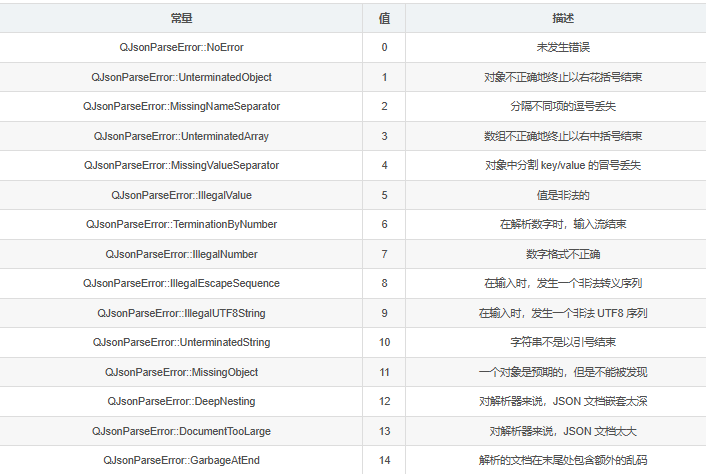

## Qt 定时器
### 1. QTimer类的使用
```cpp
// 构造函数
QTimer::QTimer(QObject *parent = nullptr);
QTimer::QTimer();

// 设置定时器时间间隔为 msec 毫秒
// 默认值是0，一旦窗口系统事件队列中的所有事件都已经被处理完，一个时间间隔为0的QTimer就会触发
void QTimer::setInterval(int msec);
// 获取定时器的时间间隔, 返回值单位: 毫秒
int QTimer::interval() const;

// 根据指定的时间间隔启动或者重启定时器, 需要调用 setInterval() 设置时间间隔
[slot] void QTimer::start();
// 启动或重新启动定时器，超时间隔为msec毫秒。
[slot] void QTimer::start(int msec);
// 停止定时器。
[slot] void QTimer::stop();

// 设置定时器精度
/*
参数: 
    - Qt::PreciseTimer -> 精确的精度, 毫秒级
    - Qt::CoarseTimer  -> 粗糙的精度, 和1毫秒的误差在5%的范围内, 默认精度
    - Qt::VeryCoarseTimer -> 非常粗糙的精度, 精度在1秒左右
*/
void QTimer::setTimerType(Qt::TimerType atype);
Qt::TimerType QTimer::timerType() const;	// 获取当前定时器的精度

// 如果定时器正在运行，返回true; 否则返回false。
bool QTimer::isActive() const;

// 判断定时器是否只触发一次
bool QTimer::isSingleShot() const;
// 设置定时器是否只触发一次, 参数为true定时器只触发一次, 为false定时器重复触发, 默认为false
void QTimer::setSingleShot(bool singleShot);
```

### 2. QTimer的信号
时间到达后会触发以下信号函数，可以用于请求超时处理
`[signal] void QTimer::timeout();`

### 3. 别的方法
只触发一次的定时器信号
参数：
- msec : 触发时间，单位：毫秒
- receiver : 接受对象地址
- method : 槽函数地址
`[static] void QTimer::singleShot(int msec, const QObject *receiver, PointerToMemberFunction method);`

### 2. QMessageBox
QMessageBox 对话框类是 QDialog 类的子类, 通过这个类可以显示一些简单的提示框, 用于展示警告、错误、问题等信息。关于这个类我们只需要掌握一些静态方法的使用就可以了。

```cpp
// 显示一个模态对话框, 将参数 text 的信息展示到窗口中
[static] void QMessageBox::about(QWidget *parent, const QString &title, const QString &text);

/*
参数:
- parent: 对话框窗口的父窗口
- title: 对话框窗口的标题
- text: 对话框窗口中显示的提示信息
- buttons: 对话框窗口中显示的按钮(一个或多个)
- defaultButton
    1. defaultButton指定按下Enter键时使用的按钮。
    2. defaultButton必须引用在参数 buttons 中给定的按钮。
    3. 如果defaultButton是QMessageBox::NoButton, QMessageBox会自动选择一个合适的默认值。
*/
// 显示一个信息模态对话框
[static] QMessageBox::StandardButton QMessageBox::information(
           QWidget *parent, const QString &title, 
           const QString &text, 
           QMessageBox::StandardButtons buttons = Ok,
           QMessageBox::StandardButton defaultButton = NoButton);

// 显示一个错误模态对话框
[static] QMessageBox::StandardButton QMessageBox::critical(
           QWidget *parent, const QString &title, 
           const QString &text, 
           QMessageBox::StandardButtons buttons = Ok,
           QMessageBox::StandardButton defaultButton = NoButton);

// 显示一个问题模态对话框
[static] QMessageBox::StandardButton QMessageBox::question(
           QWidget *parent, const QString &title, 
           const QString &text, 
           QMessageBox::StandardButtons buttons = StandardButtons(Yes | No), 
           QMessageBox::StandardButton defaultButton = NoButton);

// 显示一个警告模态对话框
[static] QMessageBox::StandardButton QMessageBox::warning(
           QWidget *parent, const QString &title, 
           const QString &text, 
           QMessageBox::StandardButtons buttons = Ok,
           QMessageBox::StandardButton defaultButton = NoButton);
```

### 3. 一些常用函数

```cpp
// 设置窗口固定大小
setFixedSize();  

// tcp连接超时处理
if (!m_tcpsock->waitForConnected(2000))
{
    qCritical()<<"连接服务器超时";
    QMessageBox::critical(static_cast<QWidget*>(this->parent()), "错误", "连接服务器超时!");
    exit(1);
}

// 设置居中
// 获取主屏幕的几何信息
QScreen *screen = QGuiApplication::primaryScreen();
QRect screenGeometry = screen->geometry();

// 计算窗口显示位置
int x = screenGeometry.center().x() - this->width() / 2;
int y = screenGeometry.center().y() - this->height() / 2;

// 将窗口移动到居中位置
this.move(x, y);

// 输入框内容获取
// 返回值是QString对象
QString username = ui->lineEditUserName->text();
QString pwd = ui->lineEditPassword->text();
// 密码框设置密码不显示模式
ui->lineEditPassword->setEchoMode(QLineEdit::Password);
```

## Qt中Json的用法
### QJson常用类
#### 1. QJsonDocument
QJsonDocument 类用于读和写 JSON 文档。

一个 JSON 文档可以使用 QJsonDocument::fromJson() 从基于文本的表示转化为 QJsonDocument， toJson() 则可以反向转化为文本。解析器非常快且高效，并将 JSON 转换为 Qt 使用的二进制表示。
已解析文档的有效性，可以使用 !isNull() 进行查询。
如果要查询一个 JSON 文档是否包含一个数组或一个对象，使用 isArray() 和 isObject()。包含在文档中的数组或对象可以使用 array() 或 object() 检索，然后读取或操作。
也可以使用 fromBinaryData() 或 fromRawData() 从存储的二进制表示创建来 JSON 文档。

#### 2. QJsonArray
QJsonArray 类封装了一个 JSON 数组。
JSON 数组是值的列表。列表可以被操作，通过从数组中插入和删除 QJsonValue 。
一个 QJsonArray 可以和一个 QVariantList 相互转换。可以使用 size() 来查询条目的数量，通过 insert() 在指定索引处插入值，removeAt() 来删除指定索引的值。

#### 3. QJsonObject
QJsonObject 类封装了一个 JSON 对象。
一个 JSON 对象是一个“key/value 对”列表，key 是独一无二的字符串，value 由一个 QJsonValue 表示。
一个 QJsonObject 可以和一个 QVariantMap 相互转换。可以使用 size() 来查询“key/value 对”的数量，通过 insert() 插入“key/value 对”， remove() 删除指定的 key。

#### 4. QJsonValue
JSON 中的值有 6 种基本数据类型：

bool（QJsonValue::Bool）
double（QJsonValue::Double）
string（QJsonValue::String）
array（QJsonValue::Array）
object（QJsonValue::Object）
null（QJsonValue::Null）
一个值可以由任何上述数据类型表示。此外，QJsonValue 有一个特殊的标记来表示未定义的值，可以使用 isUndefined() 查询。
值的类型可以通过 type() 或 isBool()、isString() 等访问函数查询。同样地，值可以通过 toBool()、toString() 等函数转化成相应的存储类型。

#### 5. QJsonParseError
QJsonParseError 类用于在 JSON 解析中报告错误。


### Json对象的简单
构造一个简单的 JSON 对象：
```json
{
    "Cross Platform": true,
    "From": 1991,
    "Name": "Qt"
}
```
生成比较简单，由于是一个对象，只需要用 QJsonObject 即可。
```cpp
// 构建 JSON 对象
QJsonObject json;
json.insert("Name", "Qt");
json.insert("From", 1991);
json.insert("Cross Platform", true);

// 构建 JSON 文档
QJsonDocument document;
document.setObject(json);
QByteArray byteArray = document.toJson(QJsonDocument::Compact);
QString strJson(byteArray);

qDebug() << strJson;
```

解析如下:
`QJsonDocument::fromJson(const QByteArray &json, QJsonParseError *error = nullptr)`
json是待解析的json字符串
error是解析错误对象

例子：
```cpp
QJsonParseError jsonError;
QJsonDocument doucment = QJsonDocument::fromJson(byteArray, &jsonError);  // 转化为 JSON 文档
if (!doucment.isNull() && (jsonError.error == QJsonParseError::NoError)) {  // 解析未发生错误
    if (doucment.isObject()) { // JSON 文档为对象
        QJsonObject object = doucment.object();  // 转化为对象
        if (object.contains("Name")) {  // 包含指定的 key
            QJsonValue value = object.value("Name");  // 获取指定 key 对应的 value
            if (value.isString()) {  // 判断 value 是否为字符串
                QString strName = value.toString();  // 将 value 转化为字符串
                qDebug() << "Name : " << strName;
            }
        }
        if (object.contains("From")) {
            QJsonValue value = object.value("From");
            if (value.isDouble()) {
                int nFrom = value.toVariant().toInt();
                qDebug() << "From : " << nFrom;
            }
        }
        if (object.contains("Cross Platform")) {
            QJsonValue value = object.value("Cross Platform");
            if (value.isBool()) {
                bool bCrossPlatform = value.toBool();
                qDebug() << "CrossPlatform : " << bCrossPlatform;
            }
        }
    }
}
```

### Json转换为std::string
```cpp
// 创建Json数据
QJsonObject userdata;
userdata.insert("username", name);
userdata.insert("password", pwd);
QJsonObject msg;
msg.insert("request", "login");
msg.insert("userdata", userdata);

// 创建 QJsonDocument 对象，用于处理 JSON 数据
QJsonDocument jsonDocument(msg);

// 将 QJsonDocument 转换为 QByteArray
QByteArray byteArray = jsonDocument.toJson();

// 将 QByteArray 转换为 std::string
std::string jsonstr = byteArray.constData();
```

## Qt中base64编解码
```cpp
// qt自带base64编码
QByteArray QByteArray::toBase64() const
QByteArray QByteArray::toBase64(QByteArray::Base64Options options) const

[static] QByteArray QByteArray::fromBase64(const QByteArray &base64)
[static] QByteArray QByteArray::fromBase64(const QByteArray &base64, 
                                           QByteArray::Base64Options options)
```

Base64Options：
| Base64Options | 含义 |
| --- | --- |
| Base64Encoding | (默认)常规Base64字母表 |
| Base64UrlEncoding | 与常规Base64不同的是将“+”和“/”分别改成了“-”和“_”，对url更友好 |
| KeepTrailingEquals | (默认)保持编码数据末尾后填充等号，数据的大小总是4的倍数 |
| OmitTrailingEquals | 省略编码数据末尾的等号 |


## Qt连接超时，下线处理
```cpp
QObject::connect(m_tcpsock, &QTcpSocket::connected, this, [](){
    qDebug() << "成功连接服务器！";
});
QObject::connect(m_tcpsock, &QTcpSocket::disconnected, parent, [parent](){
    // 在槽函数中添加条件判断，比如窗口是否正在关闭
    if (!static_cast<QWidget*>(parent)->isVisible()) {
        return;
    }
    QMessageBox::warning(static_cast<QWidget*>(parent), "警告", "服务器已离线，请等待服务器开启！");
    exit(1);
});
// 发起连接
m_tcpsock->connectToHost(m_serverIp, m_port);
// 超时处理
if (!m_tcpsock->waitForConnected(2000))
{
    QMessageBox::critical(static_cast<QWidget*>(parent), "错误发生", "连接服务器超时!");
    exit(1);
}
```

## qt窗口无法move
问题：在ubuntu的qt中编写的窗口move函数一律无效
原因：现在很多linux用wayland作为桌面显示，这样会出现一个问题，由于没有坐标系统，导致无边框窗体无法拖动和定位（一般是Qt6开始强制默认优先用wayland，之前Qt5是默认有xcb则优先用xcb）
解决方法：你需要在main函数加一行qputenv("QT_QPA_PLATFORM", "xcb");


## md5
安装库cryptopp
https://www.cryptopp.com/
sudo apt update
sudo apt install libcrypto++-dev

引入头文件
```cpp
#include <cryptopp/md5.h>
#include <cryptopp/hex.h>
#include <cryptopp/filters.h>
```
需要加入宏#define CRYPTOPP_ENABLE_NAMESPACE_WEAK 1 和使用Cyptopp::，勿使用命名空间，会造成命名冲突
创建md5函数
```cpp

std::string md5(const std::string& str) {
    // 定义变量
    CryptoPP::byte digest[CryptoPP::Weak::MD5::DIGESTSIZE];
    
    // 使用 Crypto++ 的 MD5 类进行计算
    CryptoPP::Weak::MD5 hash;
    hash.CalculateDigest(digest, (const CryptoPP::byte*)str.c_str(), str.length());
    
    // 将计算出的二进制哈希值转换成十六进制字符串
    // 使用 StringSource 和 HexEncoder 过滤器
    std::string md5Hex;
    CryptoPP::HexEncoder encoder(new CryptoPP::StringSink(md5Hex));  // 用于转换进制的编码器
    encoder.Put(digest, sizeof(digest));
    encoder.MessageEnd();
    return md5Hex;
}

```
